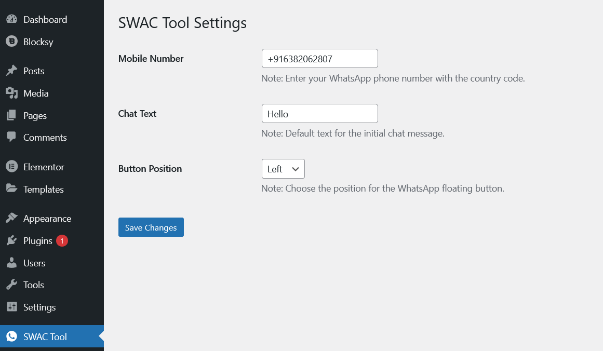

# SWAC Tool – Simple WhatsApp Chat Tool for WordPress

> ✅ A lightweight, customizable, and **simple WhatsApp chat tool** to boost user engagement on your WordPress website.

---

## 🔽 Download the Free Plugin

Click the button below to download the latest version of the SWAC Tool:

👉 [**Download SWAC Tool v2.1**](https://drive.google.com/file/d/1lcmyxuad-ZIWnmGIH-QWWQMq-D45b8ZC/view?usp=sharing)

> Developed by [Dizetech](https://dizetech.in) — *Best Website Design Company* and *Custom Plugin Design Company* in India.

---

## 🛠 What is SWAC Tool?

**SWAC Tool** (Simple WhatsApp Chat Tool) is a floating WhatsApp button free plugin for WordPress. It allows visitors to quickly open a WhatsApp chat with you, increasing real-time communication, customer support, and sales conversion. No coding needed — just install, configure, and go live in minutes!

---

## 🚀 Key Features

- 📱 Add a floating WhatsApp chat button to any WordPress site
- 🎯 Customize default message, mobile number, and position
- ⚡️ Lightweight – No jQuery or heavy assets
- 🎨 Mobile-friendly and responsive design
- 🔒 Clean code, GPL v2 licensed
- 🧩 Works with any theme or page builder

---

## 🎯 SEO Benefits

Using SWAC Tool can:

- Improve **customer interaction** and response time
- Increase **conversion rates** with instant messaging
- Reduce **bounce rate** by offering live chat support
- Enhance your site's **SEO ranking** with better engagement metrics

> The **simple WhatsApp chat tool** your WordPress site needs!

---

## ⚙️ How to Install

1. [Download the free plugin ZIP](https://drive.google.com/file/d/1lcmyxuad-ZIWnmGIH-QWWQMq-D45b8ZC/view?usp=sharing)
2. Go to `WordPress Admin → Plugins → Add New → Upload Plugin`
3. Upload the ZIP file and click **Install Now**
4. Activate the plugin
5. Go to `SWAC Tool` settings in your admin panel
6. Enter:
   - Your WhatsApp mobile number
   - Default chat message
   - Button position (left or right)
7. Save changes and you're live 🎉

---

## 🌐 About the Developer

This Free plugin is developed and maintained by [Dizetech](https://dizetech.in) — a trusted leader in:

- 🔹 **Custom WordPress Plugin Development**
- 🔹 **WooCommerce Integration**
- 🔹 **Website Speed Optimization**
- 🔹 **UI/UX & SEO-First Web Design**

> Looking for **custom plugin design** or want to build your own feature-rich tools?  
> 👉 [Contact Dizetech](https://dizetech.in#contact) – *The Best Website Design Company in India.*

---

## 📸 Screenshot

> *(Simple WhatsApp Chat Tool - SWAC-TOOL Free plugin screenshot)*

---

## 📄 License

This plugin is released under the [GNU GPL v2 License](https://www.gnu.org/licenses/old-licenses/gpl-2.0.html).  
Feel free to use, modify, and share it as needed.

---

## 🔎 SEO Keywords

`simple whatsapp chat tool`  
`wordpress whatsapp plugin`  
`floating chat button plugin`  
`best whatsapp plugin wordpress`  
`custom plugin design company`  
`best website design company`  
`live chat support plugin`  
`whatsapp integration for websites`

---

## 🏷️ Tags

`#WordPress` `#WhatsAppChat` `#LiveSupport` `#FloatingButton` `#CustomerSupport`  
`#SimpleWhatsAppChatTool` `#WebsiteDesignCompany` `#CustomPluginDesignCompany`

---

## 📬 Need Help?

For support or feature requests, contact [Dizetech](https://dizetech.in).  
We offer tailored development services to build anything you need for WordPress, WooCommerce, and beyond.

---

📦 **Download Now** → [SWAC Tool – Simple WhatsApp Chat Tool](https://drive.google.com/file/d/1lcmyxuad-ZIWnmGIH-QWWQMq-D45b8ZC/view?usp=sharing)  
🔧 **Powered by** [Dizetech – Custom Plugin Design Company](https://dizetech.in)

---
